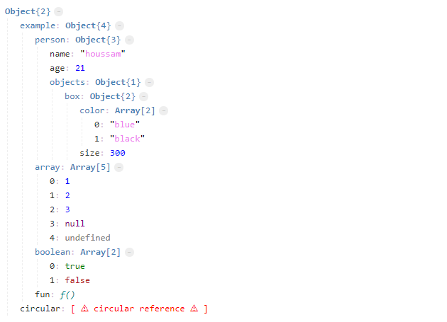

# DD - WARNING! IN DEVELOPING
## var dumper for *AdonisJS*
## BASED IN houssamdev-dd (https://github.com/HoussamDev21/dd)

> Like *Laravel dd* 



### How to use ?

1. **Installation** (via npm)
```
npm install irbm-adonisjs-dd --save
```

2. **usage**
```
const dd = use('irbm-adonisjs-dd')
...
  ... dd(yourData)
```

that's all ^^ 
